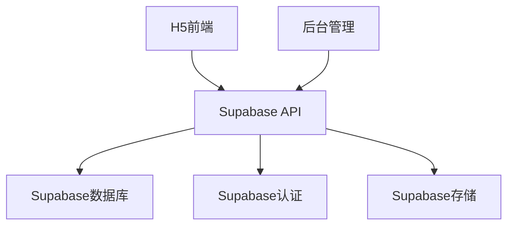
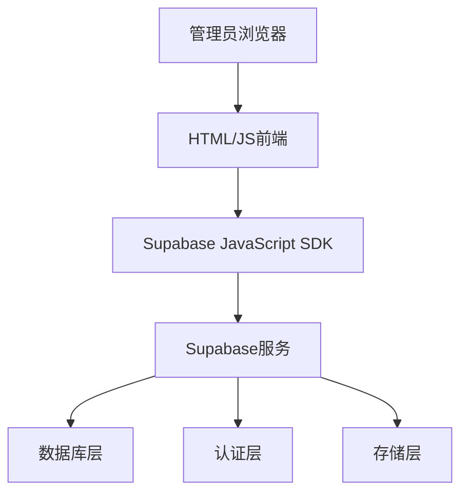
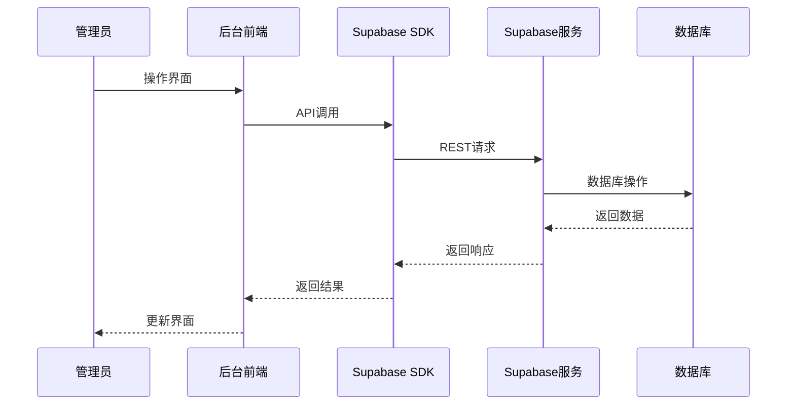

# 后台系统重构设计文档 - Supabase集成

## 1. 概述

### 1.1 项目背景
本项目是一个旅游导览H5+管理后台系统，包含前端H5展示页面和后台管理系统。根据需求，需要重构整个后台系统，使用原生HTML+JS架构，并通过Supabase完成接口交互和认证相关业务，同时保留H5端所有文件不变。

### 1.2 重构目标
- 使用原生HTML+JS重构后台管理系统
- 集成Supabase作为后端服务，处理数据存储和用户认证
- 实现H5端所需的所有配套后台功能
- 保持H5端功能不变，仅重构后台系统

### 1.3 技术栈
- 前端: HTML5, CSS3, JavaScript (ES6+)
- 后端服务: Supabase (PostgreSQL数据库, Auth认证, Storage存储)
- 部署: 静态文件托管

### 1.4 设计原则
- 最小化改动：仅重构后台系统，保持H5端不变
- 原生技术：使用纯HTML+JS，不引入额外框架
- Supabase优先：充分利用Supabase提供的各项服务
- 安全性：确保数据安全和访问控制
- 可维护性：代码结构清晰，易于后续维护

## 2. 系统架构设计

### 2.1 整体架构


### 2.2 后台系统架构


### 2.3 数据流图


### 2.4 目录结构
```
admin/
├── index.html           # 后台入口页面
├── login.html           # 登录页面
├── pages/               # 各功能页面
│   ├── dashboard.html   # 仪表盘
│   ├── categories.html  # 分类管理
│   ├── attractions.html # 景点管理
│   ├── articles.html    # 文章管理
│   ├── map-editor.html  # 地图编辑器
│   └── settings.html    # 系统设置
├── js/
│   ├── admin.js         # 主应用逻辑
│   ├── api.js           # Supabase API封装
│   ├── auth.js          # 认证相关逻辑
│   └── modules/         # 各模块JS
└── css/                 # 样式文件
```

## 3. 功能模块设计

### 3.1 认证模块
#### 3.1.1 功能描述
实现管理员登录、会话管理、权限验证等功能

#### 3.1.2 API设计
```javascript
// 登录
const { data, error } = await supabase.auth.signInWithPassword({
  email: 'admin@example.com',
  password: 'password'
});

// 登出
const { error } = await supabase.auth.signOut();

// 获取当前用户
const { data: { user } } = await supabase.auth.getUser();

// 检查管理员权限
const { data, error } = await supabase
  .from('admin_users')
  .select('*')
  .eq('id', user.id);
```

#### 3.1.2 接口设计
| 功能 | HTTP方法 | Supabase方法 | 描述 |
|------|----------|--------------|------|
| 登录 | POST | `supabase.auth.signInWithPassword()` | 管理员登录认证 |
| 登出 | POST | `supabase.auth.signOut()` | 管理员登出 |
| 会话检查 | GET | `supabase.auth.getUser()` | 检查当前用户会话 |

#### 3.1.3 权限设计
- 超级管理员: 拥有所有权限
- 普通管理员: 可管理内容，但不能管理系统设置和用户

### 3.2 仪表盘模块
#### 3.2.1 功能描述
显示系统关键指标和快捷操作入口

#### 3.2.2 数据统计
- 分类总数
- 景点总数
- 文章总数
- 系统状态

### 3.3 分类管理模块
#### 3.3.1 功能描述
管理旅游攻略的分类信息

#### 3.3.2 接口设计
| 功能 | HTTP方法 | Supabase方法 | 描述 |
|------|----------|--------------|------|
| 获取分类列表 | GET | `supabase.from('categories').select()` | 获取所有分类 |
| 创建分类 | POST | `supabase.from('categories').insert()` | 创建新分类 |
| 更新分类 | PUT | `supabase.from('categories').update()` | 更新分类信息 |
| 删除分类 | DELETE | `supabase.from('categories').delete()` | 删除分类 |

### 3.4 景点管理模块
#### 3.4.1 功能描述
管理景点信息，包括基本信息、位置、图片等

#### 3.4.2 接口设计
| 功能 | HTTP方法 | Supabase方法 | 描述 |
|------|----------|--------------|------|
| 获取景点列表 | GET | `supabase.from('attractions').select()` | 获取所有景点 |
| 创建景点 | POST | `supabase.from('attractions').insert()` | 创建新景点 |
| 更新景点 | PUT | `supabase.from('attractions').update()` | 更新景点信息 |
| 删除景点 | DELETE | `supabase.from('attractions').delete()` | 删除景点 |

### 3.5 文章管理模块
#### 3.5.1 功能描述
管理旅游攻略文章，支持发布、草稿等状态

#### 3.5.2 接口设计
| 功能 | HTTP方法 | Supabase方法 | 描述 |
|------|----------|--------------|------|
| 获取文章列表 | GET | `supabase.from('articles').select()` | 获取所有文章 |
| 创建文章 | POST | `supabase.from('articles').insert()` | 创建新文章 |
| 更新文章 | PUT | `supabase.from('articles').update()` | 更新文章信息 |
| 删除文章 | DELETE | `supabase.from('articles').delete()` | 删除文章 |

### 3.6 地图编辑器模块
#### 3.6.1 功能描述
管理手绘地图上的景点标记位置和信息

#### 3.6.2 接口设计
| 功能 | HTTP方法 | Supabase方法 | 描述 |
|------|----------|--------------|------|
| 获取标记列表 | GET | `supabase.from('map_markers').select()` | 获取所有标记 |
| 创建标记 | POST | `supabase.from('map_markers').insert()` | 创建新标记 |
| 更新标记 | PUT | `supabase.from('map_markers').update()` | 更新标记信息 |
| 删除标记 | DELETE | `supabase.from('map_markers').delete()` | 删除标记 |

### 3.7 系统设置模块
#### 3.7.1 功能描述
管理系统配置信息

#### 3.7.2 接口设计
| 功能 | HTTP方法 | Supabase方法 | 描述 |
|------|----------|--------------|------|
| 获取设置 | GET | `supabase.from('system_settings').select()` | 获取系统设置 |
| 更新设置 | PUT | `supabase.from('system_settings').upsert()` | 更新系统设置 |

## 4. 数据模型设计

### 4.1 数据库表结构
基于现有数据库设计，主要表包括：

#### 4.1.1 categories (分类表)
```sql
CREATE TABLE categories (
    id SERIAL PRIMARY KEY,
    name VARCHAR(255) NOT NULL UNIQUE,
    description TEXT,
    icon VARCHAR(100),
    sort_order INTEGER DEFAULT 0,
    is_active BOOLEAN DEFAULT true,
    created_at TIMESTAMP WITH TIME ZONE DEFAULT NOW(),
    updated_at TIMESTAMP WITH TIME ZONE DEFAULT NOW()
);
```

#### 4.1.2 attractions (景点表)
```sql
CREATE TABLE attractions (
    id SERIAL PRIMARY KEY,
    name VARCHAR(255) NOT NULL,
    category_id INTEGER REFERENCES categories(id) ON DELETE SET NULL,
    description TEXT,
    summary TEXT,
    address VARCHAR(500),
    latitude DECIMAL(10, 8),
    longitude DECIMAL(11, 8),
    phone VARCHAR(50),
    website VARCHAR(255),
    opening_hours JSONB,
    ticket_price VARCHAR(100),
    rating DECIMAL(3, 2) DEFAULT 0,
    view_count INTEGER DEFAULT 0,
    images JSONB DEFAULT '[]'::jsonb,
    features JSONB DEFAULT '[]'::jsonb,
    facilities JSONB DEFAULT '[]'::jsonb,
    is_featured BOOLEAN DEFAULT false,
    is_active BOOLEAN DEFAULT true,
    created_at TIMESTAMP WITH TIME ZONE DEFAULT NOW(),
    updated_at TIMESTAMP WITH TIME ZONE DEFAULT NOW()
);
```

#### 4.1.3 articles (文章表)
```sql
CREATE TABLE articles (
    id SERIAL PRIMARY KEY,
    title VARCHAR(255) NOT NULL,
    slug VARCHAR(255) UNIQUE,
    summary TEXT,
    content TEXT,
    cover_image VARCHAR(500),
    author VARCHAR(100),
    category_id INTEGER REFERENCES categories(id) ON DELETE SET NULL,
    views INTEGER DEFAULT 0,
    likes INTEGER DEFAULT 0,
    is_published BOOLEAN DEFAULT false,
    is_featured BOOLEAN DEFAULT false,
    published_at TIMESTAMP WITH TIME ZONE,
    created_at TIMESTAMP WITH TIME ZONE DEFAULT NOW(),
    updated_at TIMESTAMP WITH TIME ZONE DEFAULT NOW()
);
```

#### 4.1.4 admin_users (管理员表)
```sql
CREATE TABLE admin_users (
    id UUID REFERENCES auth.users(id) ON DELETE CASCADE PRIMARY KEY,
    username VARCHAR(50) NOT NULL UNIQUE,
    role VARCHAR(50) DEFAULT 'admin',
    permissions JSONB DEFAULT '[]'::jsonb,
    is_active BOOLEAN DEFAULT true,
    last_login TIMESTAMP WITH TIME ZONE,
    created_at TIMESTAMP WITH TIME ZONE DEFAULT NOW(),
    updated_at TIMESTAMP WITH TIME ZONE DEFAULT NOW()
);
```

#### 4.1.5 map_markers (地图标记表)
```sql
CREATE TABLE map_markers (
    id SERIAL PRIMARY KEY,
    attraction_id INTEGER REFERENCES attractions(id) ON DELETE CASCADE,
    x_position DECIMAL(5, 2),
    y_position DECIMAL(5, 2),
    is_active BOOLEAN DEFAULT true,
    created_at TIMESTAMP WITH TIME ZONE DEFAULT NOW(),
    updated_at TIMESTAMP WITH TIME ZONE DEFAULT NOW()
);
```

## 5. Supabase集成设计

### 5.1 认证集成
使用Supabase Auth实现管理员登录和会话管理：
- 基于邮箱/密码的认证方式
- 会话持久化存储
- 权限角色控制

### 5.2 数据库集成
使用Supabase Database实现数据存储：
- 通过JavaScript SDK操作数据库
- 实现实时订阅功能（可选）
- 使用RLS（行级安全）控制数据访问权限

### 5.3 存储集成
使用Supabase Storage实现文件存储：
- 图片上传和管理
- 文件访问控制

## 6. 安全设计

### 6.1 认证安全
- 使用Supabase内置认证机制
- 管理员角色权限控制
- 会话过期处理

### 6.2 数据安全
- 使用RLS控制数据访问权限
- 敏感信息加密存储
- SQL注入防护

### 6.3 API安全
- 请求验证和过滤
- 速率限制
- 错误信息处理

## 6.4 错误处理与日志记录
- 统一错误处理机制
- 日志记录和监控
- 异常恢复策略

## 7. 性能优化

### 7.1 前端优化
- 代码分割和懒加载
- 图片懒加载
- 本地缓存策略

### 7.2 数据库优化
- 合理使用索引
- 查询优化
- 分页处理

## 8. 部署方案

### 8.1 静态文件部署
- 后台系统作为静态HTML文件部署
- 通过CDN加速访问
- HTTPS支持

### 8.2 Supabase配置
- 数据库表结构初始化
- RLS策略配置
- 存储桶配置

## 9. 开发计划

### 9.1 第一阶段：基础架构搭建
- [ ] 配置Supabase项目
- [ ] 实现基础认证功能
- [ ] 搭建后台页面框架
- [ ] 实现导航和路由功能

### 9.2 第二阶段：核心功能开发
- [ ] 实现分类管理模块
- [ ] 实现景点管理模块
- [ ] 实现文章管理模块
- [ ] 实现地图编辑器模块

### 9.3 第三阶段：系统完善
- [ ] 实现系统设置模块
- [ ] 添加权限控制
- [ ] 优化用户界面
- [ ] 进行功能测试

### 9.4 第四阶段：部署上线
- [ ] 配置生产环境
- [ ] 数据迁移
- [ ] 系统测试
- [ ] 正式上线

## 10. 测试策略

### 10.1 单元测试
- 认证模块测试
- 各功能模块接口测试
- 数据验证测试

### 10.2 集成测试
- Supabase服务集成测试
- 前后端数据交互测试

### 10.3 用户验收测试
- 功能完整性验证
- 用户体验测试
- 性能测试

### 10.4 安全测试
- 认证安全测试
- 数据访问控制测试
- 输入验证测试