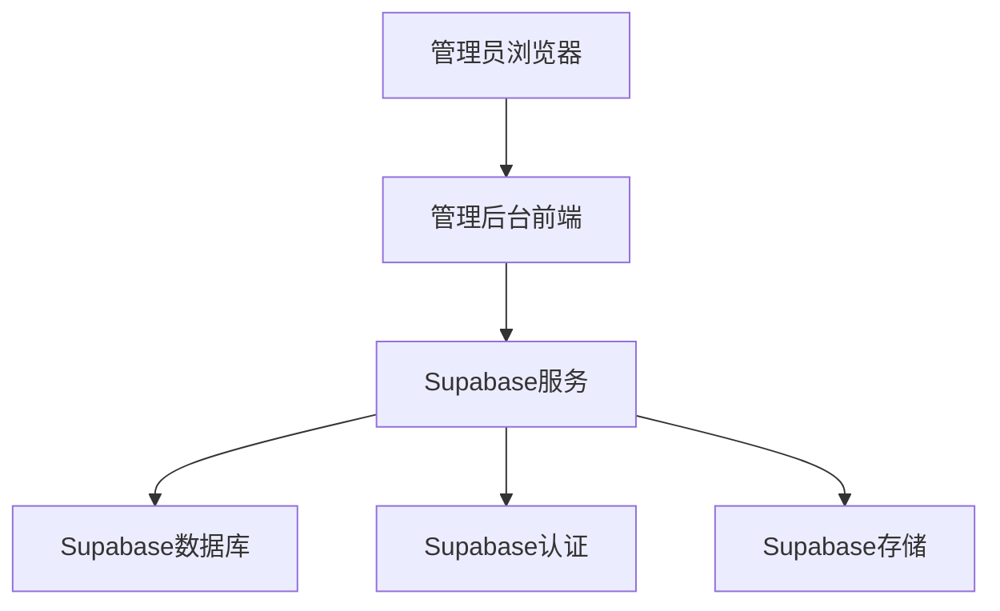
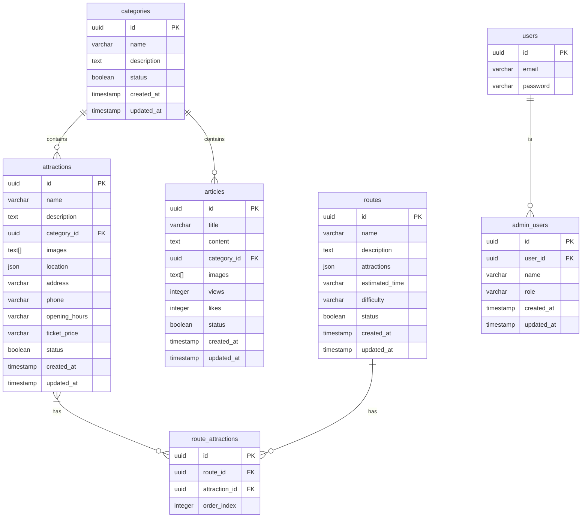
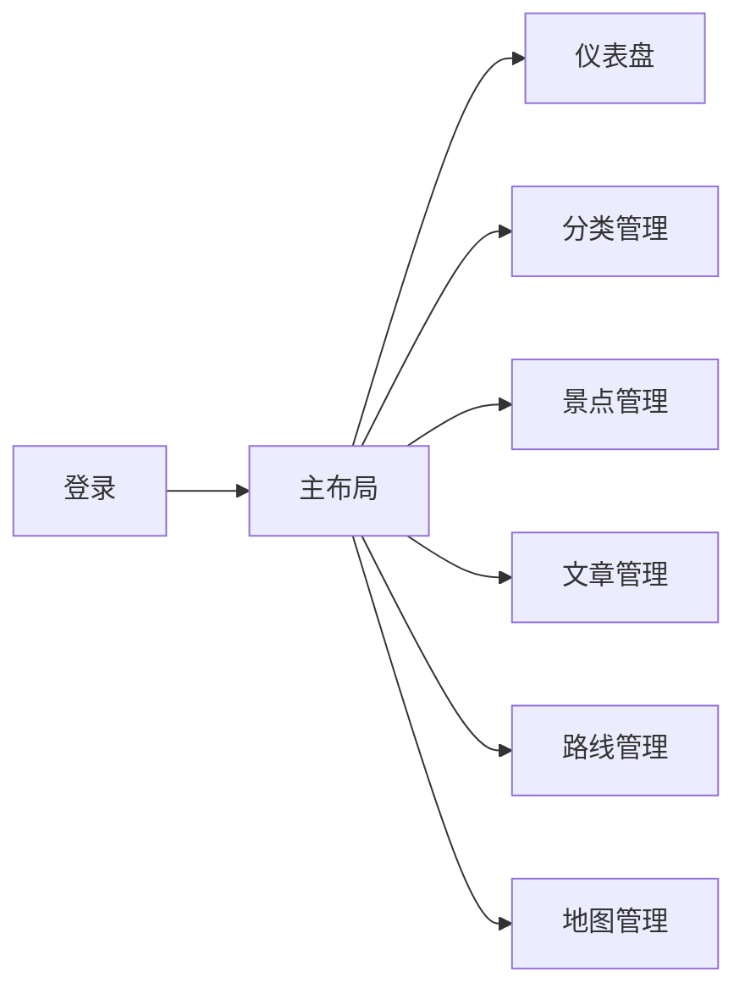

# H5项目分析与管理后台设计开发文档

## 1. 项目概述

### 1.1 项目简介
本项目是一个旅游导览H5应用，包含攻略和地图两个主要功能模块。用户可以通过攻略模块浏览旅游相关信息，通过地图模块查看景点位置并进行导航。

### 1.2 技术栈
- 前端：HTML5、CSS3、原生JavaScript
- 后端：Supabase（作为后端服务）
- 数据库：Supabase PostgreSQL
- 部署：静态网站托管

## 2. H5项目功能分析

### 2.1 攻略模块
攻略模块主要用于展示旅游相关信息，包括景点介绍、美食推荐、住宿指南、购物攻略和文化体验等内容。

#### 2.1.1 核心功能
- 文章分类展示：按景点、美食、住宿、购物、文化等分类展示文章
- 文章列表：展示文章标题、摘要、图片、浏览量、点赞数等信息
- 文章搜索：支持按关键词搜索相关文章
- 文章详情：查看文章详细内容（当前为模拟数据）

#### 2.1.2 数据结构
- 文章ID
- 标题
- 摘要
- 分类
- 图片URL
- 发布日期
- 浏览量
- 点赞数

### 2.2 地图模块
地图模块提供交互式地图功能，用户可以在地图上查看景点位置并获取导航信息。

#### 2.2.1 核心功能
- 地图展示：显示手绘风格的旅游地图
- 地图交互：支持拖拽、缩放等操作
- 景点标记：在地图上标记重要景点位置
- 景点信息：点击标记查看景点详细信息
- 导航功能：提供到景点的导航链接

#### 2.2.2 数据结构
- 景点ID
- 景点名称
- 景点描述
- 图片URL
- 坐标信息（经纬度）

### 2.3 现有数据管理方式
当前项目使用模拟数据进行展示，没有连接真实的后端服务。需要开发管理后台来管理真实数据。

## 3. 管理后台设计

### 3.1 技术架构
- 前端框架：Vue.js 3 + Element Plus
- 状态管理：Pinia
- 路由管理：Vue Router
- HTTP客户端：Axios
- 后端服务：Supabase
- 数据库：Supabase PostgreSQL
- 身份认证：Supabase Auth

### 3.2 系统架构图


### 3.3 功能模块设计

#### 3.3.1 用户认证模块
- 管理员登录/登出
- 权限验证
- 会话管理

#### 3.3.2 仪表盘模块
- 数据统计展示（文章数、景点数、分类数、路线数）
- 快捷操作入口

#### 3.3.3 分类管理模块
- 分类列表展示
- 添加分类
- 编辑分类
- 删除分类（需检查关联数据）

#### 3.3.4 景点管理模块
- 景点列表展示（支持分类筛选和搜索）
- 添加景点
- 编辑景点
- 删除景点
- 景点详情查看

#### 3.3.5 攻略文章管理模块
- 文章列表展示（支持分类筛选和搜索）
- 添加文章
- 编辑文章
- 删除文章
- 文章详情查看

#### 3.3.6 路线管理模块
- 路线列表展示
- 添加路线
- 编辑路线
- 路线详情查看

#### 3.3.7 地图打点管理模块
- 地图背景上传
- 景点标记管理（添加、编辑、删除标记）
- 标记位置调整
- 标记信息编辑（名称、描述等）

## 4. 数据库设计

### 4.1 数据表结构

#### 4.1.1 分类表(categories)
| 字段名 | 类型 | 描述 |
|--------|------|------|
| id | UUID | 主键 |
| name | VARCHAR | 分类名称 |
| description | TEXT | 分类描述 |
| status | BOOLEAN | 状态（启用/禁用） |
| created_at | TIMESTAMP | 创建时间 |
| updated_at | TIMESTAMP | 更新时间 |

#### 4.1.2 景点表(attractions)
| 字段名 | 类型 | 描述 |
|--------|------|------|
| id | UUID | 主键 |
| name | VARCHAR | 景点名称 |
| description | TEXT | 景点描述 |
| category_id | UUID | 分类ID（外键） |
| images | TEXT[] | 图片URL数组 |
| location | JSON | 坐标信息（相对于地图的百分比位置） |
| address | VARCHAR | 详细地址 |
| phone | VARCHAR | 联系电话 |
| opening_hours | VARCHAR | 开放时间 |
| ticket_price | VARCHAR | 门票价格 |
| status | BOOLEAN | 状态（启用/禁用） |
| created_at | TIMESTAMP | 创建时间 |
| updated_at | TIMESTAMP | 更新时间 |

#### 4.1.3 文章表(articles)
| 字段名 | 类型 | 描述 |
|--------|------|------|
| id | UUID | 主键 |
| title | VARCHAR | 文章标题 |
| content | TEXT | 文章内容 |
| category_id | UUID | 分类ID（外键） |
| images | TEXT[] | 图片URL数组 |
| views | INTEGER | 浏览量 |
| likes | INTEGER | 点赞数 |
| status | BOOLEAN | 状态（发布/草稿） |
| created_at | TIMESTAMP | 创建时间 |
| updated_at | TIMESTAMP | 更新时间 |

#### 4.1.4 路线表(routes)
| 字段名 | 类型 | 描述 |
|--------|------|------|
| id | UUID | 主键 |
| name | VARCHAR | 路线名称 |
| description | TEXT | 路线描述 |
| attractions | JSON | 景点列表 |
| estimated_time | VARCHAR | 预估时间 |
| difficulty | VARCHAR | 难度等级 |
| status | BOOLEAN | 状态（启用/禁用） |
| created_at | TIMESTAMP | 创建时间 |
| updated_at | TIMESTAMP | 更新时间 |

#### 4.1.5 管理员用户表(admin_users)
| 字段名 | 类型 | 描述 |
|--------|------|------|
| id | UUID | 主键 |
| user_id | UUID | Supabase用户ID（外键） |
| name | VARCHAR | 管理员姓名 |
| role | VARCHAR | 角色 |
| created_at | TIMESTAMP | 创建时间 |
| updated_at | TIMESTAMP | 更新时间 |

### 4.2 表关系图


## 5. API接口设计

### 5.1 认证接口
| 接口 | 方法 | 路径 | 描述 |
|------|------|------|------|
| 管理员登录 | POST | /auth/login | 管理员登录 |
| 检查权限 | GET | /auth/check | 检查管理员权限 |
| 登出 | POST | /auth/logout | 管理员登出 |

### 5.2 仪表盘接口
| 接口 | 方法 | 路径 | 描述 |
|------|------|------|------|
| 获取统计数据 | GET | /dashboard/stats | 获取各项数据统计 |

### 5.3 分类管理接口
| 接口 | 方法 | 路径 | 描述 |
|------|------|------|------|
| 获取分类列表 | GET | /categories | 获取所有分类 |
| 获取分类详情 | GET | /categories/{id} | 获取指定分类详情 |
| 创建分类 | POST | /categories | 创建新分类 |
| 更新分类 | PUT | /categories/{id} | 更新指定分类 |
| 删除分类 | DELETE | /categories/{id} | 删除指定分类 |

### 5.4 景点管理接口
| 接口 | 方法 | 路径 | 描述 |
|------|------|------|------|
| 获取景点列表 | GET | /attractions | 获取所有景点（支持筛选和搜索） |
| 获取景点详情 | GET | /attractions/{id} | 获取指定景点详情 |
| 创建景点 | POST | /attractions | 创建新景点 |
| 更新景点 | PUT | /attractions/{id} | 更新指定景点 |
| 删除景点 | DELETE | /attractions/{id} | 删除指定景点 |

### 5.5 文章管理接口
| 接口 | 方法 | 路径 | 描述 |
|------|------|------|------|
| 获取文章列表 | GET | /articles | 获取所有文章（支持筛选和搜索） |
| 获取文章详情 | GET | /articles/{id} | 获取指定文章详情 |
| 创建文章 | POST | /articles | 创建新文章 |
| 更新文章 | PUT | /articles/{id} | 更新指定文章 |
| 删除文章 | DELETE | /articles/{id} | 删除指定文章 |

### 5.6 路线管理接口
| 接口 | 方法 | 路径 | 描述 |
|------|------|------|------|
| 获取路线列表 | GET | /routes | 获取所有路线 |
| 获取路线详情 | GET | /routes/{id} | 获取指定路线详情 |
| 创建路线 | POST | /routes | 创建新路线 |
| 更新路线 | PUT | /routes/{id} | 更新指定路线 |

### 5.7 地图管理接口
| 接口 | 方法 | 路径 | 描述 |
|------|------|------|------|
| 获取地图配置 | GET | /map/config | 获取地图配置信息 |
| 更新地图背景 | PUT | /map/background | 更新地图背景图片 |
| 获取标记列表 | GET | /map/markers | 获取所有标记 |
| 添加标记 | POST | /map/markers | 添加新标记 |
| 更新标记 | PUT | /map/markers/{id} | 更新指定标记 |
| 删除标记 | DELETE | /map/markers/{id} | 删除指定标记 |

## 6. 管理后台前端设计

### 6.1 页面结构
```
管理后台
├── 登录页面
├── 主布局
│   ├── 顶部导航栏
│   ├── 侧边栏菜单
│   └── 内容区域
├── 仪表盘页面
├── 分类管理
│   ├── 分类列表
│   ├── 添加分类
│   └── 编辑分类
├── 景点管理
│   ├── 景点列表
│   ├── 添加景点
│   └── 编辑景点
├── 文章管理
│   ├── 文章列表
│   ├── 添加文章
│   └── 编辑文章
├── 路线管理
│   ├── 路线列表
│   ├── 添加路线
│   └── 编辑路线
└── 地图管理
    ├── 地图背景管理
    └── 地图标记管理
```

### 6.2 组件设计

#### 6.2.1 布局组件
- Layout：主布局组件
- Header：顶部导航栏组件
- Sidebar：侧边栏菜单组件
- Breadcrumb：面包屑导航组件

#### 6.2.2 公共组件
- DataTable：数据表格组件
- FormDialog：表单弹窗组件
- ImageUpload：图片上传组件
- RichTextEditor：富文本编辑器组件

#### 6.2.3 业务组件
- CategoryList：分类列表组件
- AttractionList：景点列表组件
- ArticleList：文章列表组件
- RouteList：路线列表组件

### 6.3 路由设计


## 7. 安全设计

### 7.1 认证安全
- 使用Supabase Auth进行身份认证
- 管理员权限验证
- JWT Token保护API接口
- 登录状态保持与过期处理

### 7.2 数据安全
- 数据库访问权限控制
- 敏感信息加密存储
- SQL注入防护
- XSS攻击防护

### 7.3 应用安全
- CORS策略配置
- 请求频率限制
- 输入数据验证
- 文件上传安全检查

## 8. 部署方案

### 8.1 前端部署
- 使用Vite构建项目
- 部署到静态网站托管服务（如Vercel、Netlify）
- 配置自定义域名
- 启用HTTPS

### 8.2 后端部署
- 使用Supabase云服务
- 配置数据库表结构
- 设置访问策略(RLS)
- 配置存储桶

### 8.3 数据库部署
- Supabase PostgreSQL数据库
- 表结构迁移
- 初始数据导入
- 备份策略配置

## 9. 开发计划

### 9.1 第一阶段：环境搭建与基础功能
- 搭建Vue3 + Element Plus开发环境
- 配置Supabase服务
- 实现用户认证模块
- 开发仪表盘页面

### 9.2 第二阶段：核心功能开发
- 开发分类管理模块
- 开发景点管理模块
- 开发文章管理模块
- 开发路线管理模块
- 开发地图打点管理模块

### 9.3 第三阶段：功能完善与测试
- 完善各模块功能
- 进行功能测试
- 优化用户界面
- 编写使用文档

### 9.4 第四阶段：部署上线
- 项目构建与打包
- 部署到生产环境
- 进行线上测试
- 正式上线运行